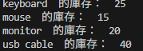
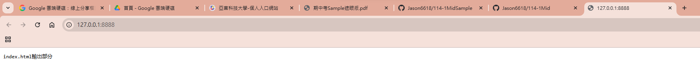
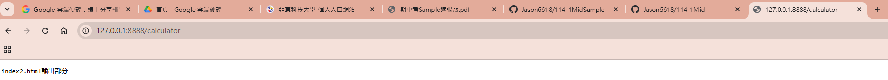
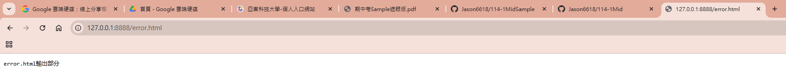
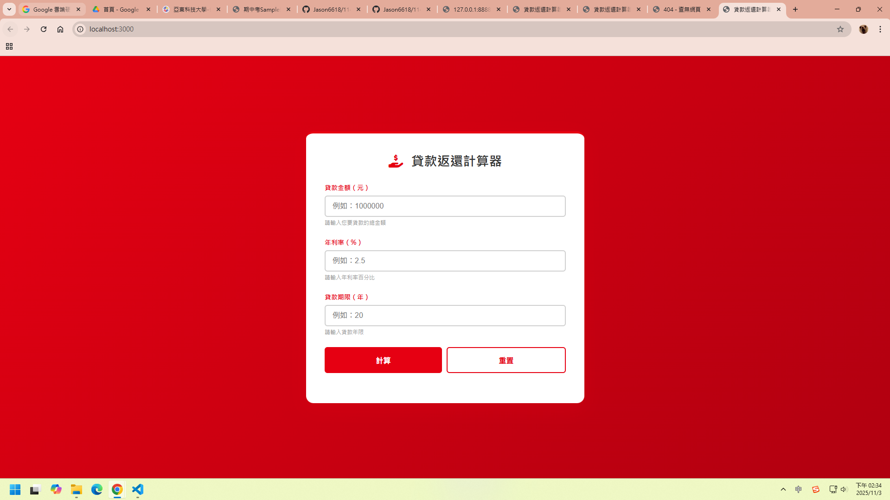
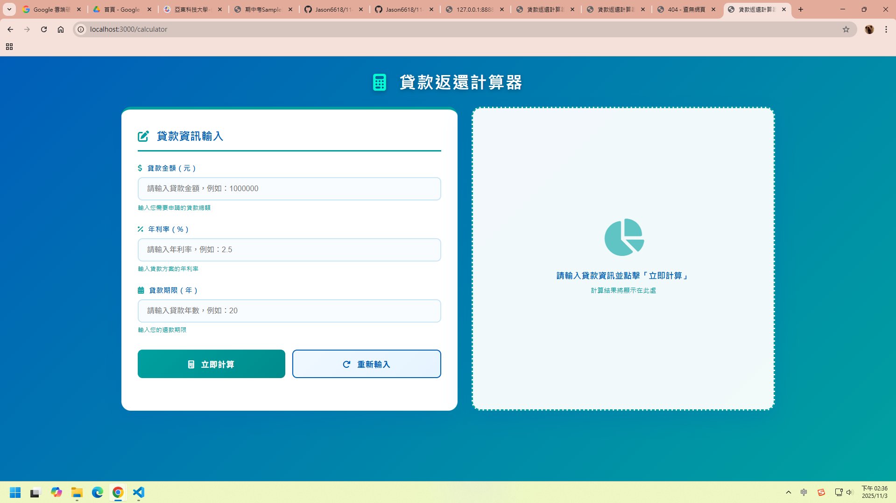
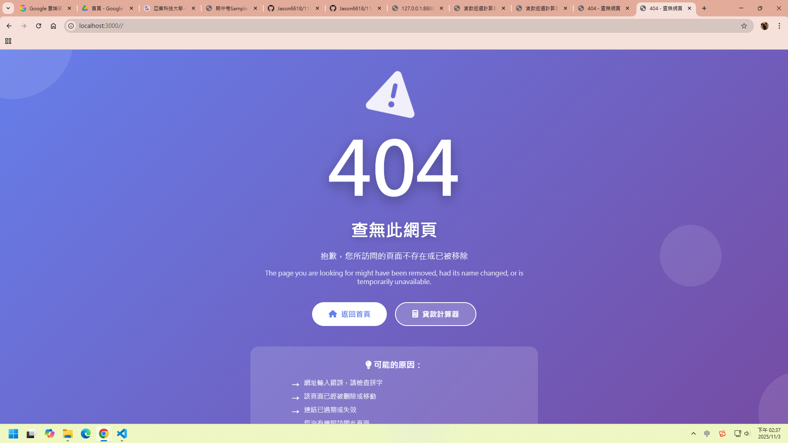

# 第2次隨堂題目-隨堂-QZ2
>
>學號：112111105   (學號和姓名都要寫)
><br />
>姓名：林振宇
>

本份文件包含以下主題：(至少需下面兩項，若是有多者可以自行新增)
- [x] 說明內容

## 說明程式與內容

開始寫說明，該說明需說明想法，
並於之後再對上述想法的每一部分將程式進一步進行展現，
若需引用程式區則使用下面方法，
若為.cs檔內程式除了於敘述中需註明檔案名稱外，
還需使用語法` ```語言種類 程式碼 ``` `，其中語言種類若是要用python則使用py，java則使用java，C/C++則使用cpp，
下段程式碼為語言種類選擇csharp使用後結果：

```csharp
public void mt_getResult(){
    ...
}
```

若要於內文中標示部分網頁檔，則使用以下標籤` ```html 程式碼 ``` `，
下段程式碼則為使用後結果：

```html
<%@ Page Language="C#" AutoEventWireup="true" ...>

<!DOCTYPE html>

<html xmlns="http://www.w3.org/1999/xhtml">
<head runat="server">
<meta http-equiv="Content-Type" ...>
    <title></title>
</head>
<body>
    <form id="form1" runat="server">
        <div>
        </div>
    </form>
</body>
</html>
```
更多markdown方法可參閱[https://ithelp.ithome.com.tw/articles/10203758](https://ithelp.ithome.com.tw/articles/10203758)

請在撰寫"說明程式與內容"該塊內容，請把原該塊內上述敘述刪除，該塊上述內容只是用來指引該怎麼撰寫內容。

1. a.

Ans: 

ㄧ.

1.變量宣告

2.常量

3.陣列

4.物件

5.對像陣列（Array of Objects）

二. 解釋

 變數宣告 ,用來建立一個能儲存資料的空間。

 常數,表示該變數的參照不能被重新指定不可再重新指定為其他資料，但其內容仍可修改。

 陣列,用來存放多筆資料，並以索引index區分。

 對象,一種以屬性名稱：屬性值(key :value ) 組成的資料結構。

對像陣列,陣列中的每一個元素都是一個物件，常用來表示多筆相同類型的資料。

1. b.

Ans:
```
<!DOCTYPE html>

<html xmlns="http://www.w3.org/1999/xhtml">
<head runat="server">
<meta http-equiv="Content-Type" ...>
    <title></title>
</head>
<body>
    <form id="form1" runat="server">
        <div>
        function getLowStock(products) {
  const lowStockItems = products
    .filter(item => item.stock < 10)
    .map(item => item.name);

  console.log(`庫存少於 10 的項目： [ '${lowStockItems.join("', '")}' ]`);
}
        </div>
    </form>
</body>
</html>
```
<!-- 
接收一個商品數組products。

篩選出庫存少於10 的商品。

提取這些商品的名稱。

將這些名稱列印到控制台。

簡單來說，它可以幫助你查看哪些商品庫存不足。 -->


1. c.

Ans:
```
<!DOCTYPE html>

<html xmlns="http://www.w3.org/1999/xhtml">
<head runat="server">
<meta http-equiv="Content-Type" ...>
    <title></title>
</head>
<body>
    <form id="form1" runat="server">
        <div>
        function updateStock(products, updates) {
  const updatePairs = updates.split(',');

  // 逐一處理每組更新
  updatePairs.forEach(pair => {
    const [name, stockStr] = pair.split(':');
    const stock = parseInt(stockStr);

    // 尋找 products 中對應名稱的項目並更新
    for (let item of products) {
      if (item.name === name.trim()) {
        item.stock = stock;
      }
    }
  });

  // 更新後輸出所有產品的庫存
  products.forEach(item => {
    console.log(`${item.name}  的庫存：  ${item.stock}`);
  });
}
        </div>
    </form>
</body>
</html>
```

<!--  
解析updates字符串：

updates字串包分產品名稱:庫存數量。

處理每組資：

使用forEach()迭代每一組

每一組資料通過split(':')來拆解產品名稱和parseInt()）。

更新products數組中的庫存：

遍歷products數組

如果找到名稱匹配的產品，則將其庫存設置

輸出更新：

最後，遍歷products數組，並在控  -->

2. a.

Ans:
    
    
```
<!DOCTYPE html>

<html xmlns="http://www.w3.org/1999/xhtml">
<head runat="server">
<meta http-equiv="Content-Type" ...>
    <title></title>
</head>
<body>
    <form id="form1" runat="server">
        <div>
switch (url) {
    case '/':
      answer = 'index.html輸出部分';
      break;
    case '/calculator':
      answer = 'index2.html輸出部分';
      break;
    default:
      answer = 'error.html輸出部分';
      break;
  }
        </div>
    </form>
</body>
</html>
```
<!--   

* `switch (url)`：根據變數 `url` 的值來做不同的處理。
* `case '/'`：如果網址是根目錄 `/`，就顯示 `index.html` 的內容。
* `case '/calculator'`：如果網址是 `/calculator`，就顯示 `index2.html` 的內容。
* `default`：如果網址不符合以上任何一種情況，則顯示 `error.html`錯誤頁面。
也就是說，這段程式在做網址導向 或 頁面選擇的功能。
  -->

2. b.

Ans:
    
```
<!DOCTYPE html>

<html xmlns="http://www.w3.org/1999/xhtml">
<head runat="server">
<meta http-equiv="Content-Type" ...>
    <title></title>
</head>
<body>
    <form id="form1" runat="server">
        <div>
          // Switch根據不同路由要寫的部分
switch (req.url) 
  // 首頁路由（http://localhost:3000/）

  // 當使用者進入根目錄「/」時，
  // 將要回傳的 EJS 模板設定為 index.ejs（首頁畫面）
    case '/':
      filePath = '/index.ejs';
      break;
  // 其他所有情況（預設分支）
  // 如果網址不是「/」或「/calculator」，
  // 就要判斷是不是在請求「靜態資源」。
  // 例如：
  //   /style.css
  //   /script.js
  //   /logo.png
  //   /banner.jpg
  // 若是以上這些，代表使用者只是要載入前端資源，不是進入頁面。

    case '/calculator':
      //當使用者請求/calculator網址/index2.ejs這個頁面。
      filePath = '/index2.ejs';
      break;
        </div>
    </form>
</body>
</html>
```

<!--  
Switch根據不同路由要寫的部分，當使用者進入根目錄「/」時， 將要回傳的 EJS 模板設定為 index.ejs（首頁畫面）
其他所有情況（預設分支）

如果網址不是「/」或/calculator， 就要判斷是不是在請求靜態資源。
其他所有情況（預設分支）

  -->

2. c.

Ans:
```
<!DOCTYPE html>

<html xmlns="http://www.w3.org/1999/xhtml">
<head runat="server">
<meta http-equiv="Content-Type" ...>
    <title></title>
</head>
<body>
    <form id="form1" runat="server">
        <div>
        default:
      //如果不是/calculator（default區塊
      if (req.url.endsWith('.css') || req.url.endsWith('.js') || req.url.endsWith('.png') || req.url.endsWith('.jpg')) {
        //判斷請求是否要拿靜態檔案，例如.css、.js、圖片等。
        // 如果是，就把該資源路徑記錄到fileOtherFile。
        // 若是靜態資源，就記錄它的檔案路徑
        fileOtherFile = req.url;
      } else {
        //如果不是靜態檔，也沒有對應的路由（例如/about、/home等），
        // 就代表請求的網址不存在→ 顯示404 頁 index3.ejs
        // 否則表示請求的網址不存在 → 顯示 404 頁面
        filePath = '/index3.ejs'; // 404 頁面
      }
      break;
        </div>
    </form>
</body>
</html>
```
<!--  
如果是靜態檔案（.css/.js/.jpg/.png），→ 找出對應的檔案。
如果不是靜態檔案→ 顯示404  -->

2. d.

Ans:


